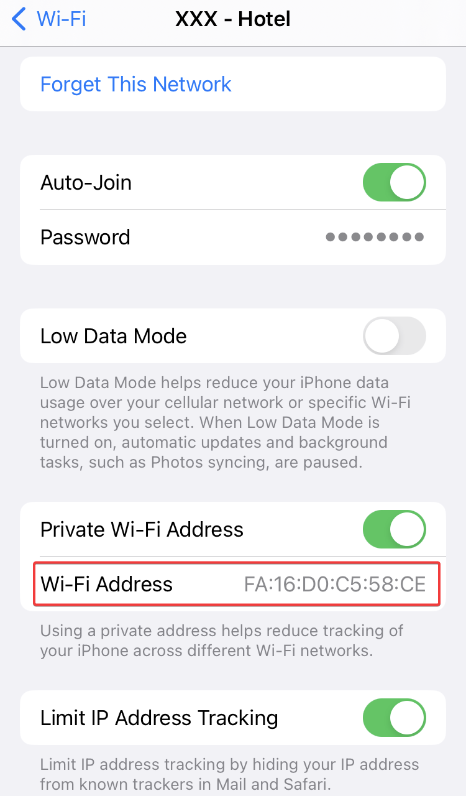
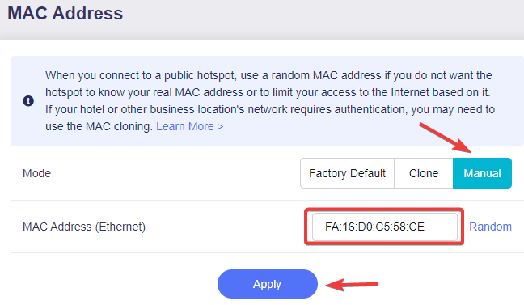
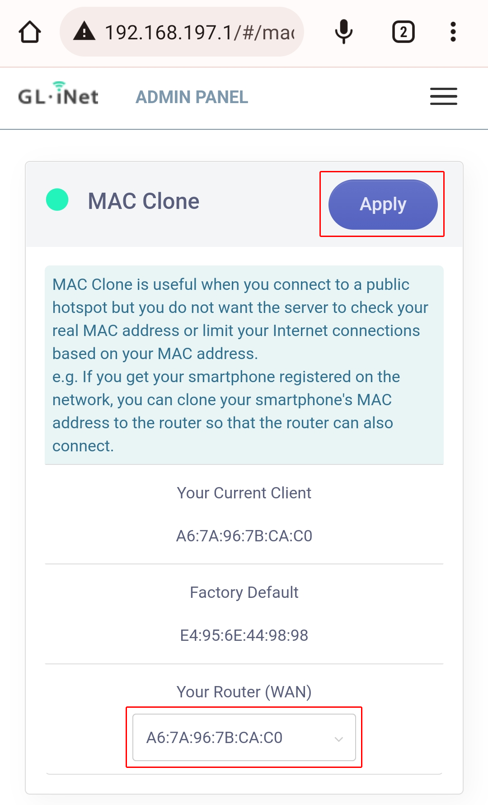

+++
categories = ['Technology']
codeLineNumbers = false
codeMaxLines = 10
date = "2023-06-11T07:20:06-06:00"
year = "2023"
month = "2023-06"
description = ''
draft = false
featureImage = ''
featureImageAlt = ''
featureImageCap = ''
figurePositionShow = true
shareImage = ''
tags = ['featured', '']
thumbnail = ''
title = "Digital Nomad Captive Portal TravelRouter"
toc = false
usePageBundles = true
+++

So like a lot of the content on this blog, I was asked on reddit to cover this topic so here is a post about using the TravelRouter to connect to a Captive Portal like in an airport, hotel, or coffee shop.

In this post I will be covering how to do this by cloning the MAC address of your mobile device to the travel router to bypass the captive portal on your other devices once you have completed it once on the mobile device. There are two ways to do this and I will cover both

The first is Manual Clone:

Connect your mobile device to the network with the captive portal, complete the captive portal with the mobile device and then connect to the TravelRouter Wi-Fi with that same device.

On an iOS device you will go to settings -> Wi-Fi -> Hotel Network and copy the MAC address

*I am waiting on some android screenshots also, once I get those I will update this post with how to display the MAC on android.*

login to the admin portal and got to Admin Panel -> NETWORK -> MAC Address and select Manual, then paste the MAC address we copied from the mobile device into the field and click apply

The second is the Mac Cloner:

Connect your mobile device to the network with the captive portal, complete the captive portal with the mobile device and then connect to the trave router wifi with that same device.

The MAC Cloner tab which can be found at Admin Panel -> MORE SETTINGS -> MAC Clone, Ensure that the MAC address for your mobile device is selected in the drop down and click apply. 

You may need to reboot the travel router for the settings the take effect or be noticed by the network with the captive portal but once it comes back up you will now be able to connect your work and/or other personal devices to the travel router and it will bypass the captive portal because the network thinks that the travel router is your mobile device. 

