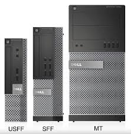
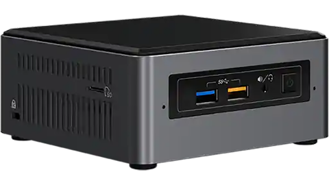
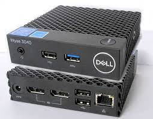

+++
categories = ['Technology']
codeLineNumbers = false
codeMaxLines = 10
date = "2023-04-06T12:11:07-06:00"
year = "2023"
month = "2023-04"
description = ''
draft = false
featureImage = ''
featureImageAlt = ''
featureImageCap = ''
figurePositionShow = true
shareImage = ''
tags = ['featured', 'Tech', 'Digital Nomad', 'Pinned']
thumbnail = ''
title = "Digital Nomad RDP"
toc = false
usePageBundles = true
series = 'Digital Nomad'
+++

**This is a Draft/In-Progress post, Content is not complete until this notice is removed**

Alright, Its been a while since I posted in the [Digital Nomad Series](https://techrelay.xyz/series/digital-nomad/). Life happened, Work got busy, I got laid off and lost motivation to post here but job prospects have started to look up and that motivation has returned so here is the next in the Digital Nomad Series, How to setup an emergency or backup system for use in the event that your [Digital Nomad VPN](https://techrelay.xyz/post/digital-nomad-rdp/) doesnt work or is down. 

First and foremost let me itterate that even with the perfect setup like we talked about in the beginning of this series, you are still bound to have issues now and then. Lets take my client "Mike" as an example, he reached out to me shortly after I published the start of this series and offered to pay me for setup, I got him all setup and off he went, however he has had some issues here and there in which he has reached out and I got him sorted promptly but the moral of this ted talk is what if I wasnt available right away? what if I am available but cant fix it? What if you set this up yourself and fail to diagnose or remediate the issue on your own? (I do offer my services for both setup and support, check out the contact page for a link to schedule time with via Calendly. My rates are very reasonable and I offer contiuned support as well!) what if the hardware on the US side (the HomeRouter as mentioned in the former of the series) has crashed or is not responding? At this point your fucked, your dead in the water with no paddle, your option is pretty much only one, get on a plane and go back to the states (or your home nation) ASAP! which is not really ideal nor feasible for everyone thus here is the second part of the series, How to setup a USFF (Ultra Small Form Factor), NUC, x86 Thing client, etc... with RDP published to the internet (I will cover several ways of this, from super secure by using a cloudflare tunnel or mesh network like tailscale to just simply publishing the RDP port and using MFA to make it secure) The latter of those is the proper way and my recodmended setup however I will cover how to just expose the RDP port and secure your account by requiring more than one factor of authentication. 

Lets jump in, First we need to discuss hardware, I dont personally have one recomendation so we will cover a few different catagories starting with USFF and Micro PC's. These can be picked up for extremely cheap, often for $150 or less, from places like Ebay or Gov Auction sites. Lets start with USFF, My personal brand choice is Dell but other vendors make the same types of machines. A good choice from dell would be the Optiplex 9020 (insert image here), in this image we have from Right to Left the 9020 MiniTower (would be a normal size tower like ATX size), In the middle we have the 9020 SFF (This Small form factor would also be a good choice but as you can see is still a decent amount larger than the USFF size to the Left), and last we have the 9020 USFF and as you can see its much smaller than both the MiniTower and the SFF size thus we would want the USFF model to take up as little space at its host location as possible. 

Second we will cover NUC's, There are so many models and/or manufactureres that make the NUC's so I will just be using a generic photo here but you get the idea of the form factor/size footprint of this option, These can also be picked up for cheap albeit more than the previous option (between $200-$600 depening on new/used/generation) but they are also much more powerful and are in current production so if price is no issue you would get a current gen intel processor for a whopping $1000+. This is good option if you also want to be able to do personal stuff like remote/streaming Gaming as a lot of these support thunderbolt 3 and can facilitate an E-GPU (I will do another series covering this as well as I think its a common topic these days)

Lastly we will talk about MicroPC's and x86/64 Thin Clients that are more than powerfull enough for a remote work option. These are going to be about the same form factor as the NUC, maybe a little bigger but thinner, they are also going to be the cheapest option as they are plentiful used on ebay from Enterprises refreshing their tech footprint. We will use the Dell Wyse 3040 as an example here (insert picture) and can be picked up for anywhere from $20 to $100+ depening on model and specs, (like all previous options this form factor can be found by many manufacturers) these are going to be the least powerful but should still be more than enough for most work consisting of Email, Web based Applications or Fat Clients but wont be enough for things like photoshop or compiling code, so there we have all the obvious options for hardware lets move on to the "How it works" part of this post. 

Alright so you have chosen your hardware at this point and are almost ready to get setup, Lets talk about how it works, You put your remote workstation at a location in the US or your home nation (this can be the same location as your HomeRouter or another location to add redundancy in the event that your HomeRouter is down from a reason like an ISP outage in which case your remote workstation would be down too so ultimatly I would recomend putting this somewhere else but if you only have the location of your HomeRouter then that works too albeit losing the redundancy aspect.)

So lets start at the basics, Windows computers have, Built-in to the OS, a feature called [Remote Desktop or RDP (Remote Desktop Protocol for short.)](https://en.wikipedia.org/wiki/Remote_Desktop_Protocol) This is the lifeblood of this setup (there are other ways of connecting remotely to the desktop like VNC, NoVNC, Teamviewer, etc... but they all have perfomance issues compared to using the built-in OS level feature of RDP thus we will only cover those as a backup connection method if RDP is down due to issues like dynamic ip changes, dyndns issues, port issues etc... as options like anydesk or teamviewer can punch through without the need for port forwards) All windows versions currently supported will have both the Application to connect to other machines with RDP as well as the ability to enable those remote connections to them, so its as simple as going into the settings on that machine and enabling remote connections and adding the user you want to be able to connect with to the right group. Check out [How to Enable RDP](https://learn.microsoft.com/en-us/windows-server/remote/remote-desktop-services/clients/remote-desktop-allow-access) for Microsoft's documentation on how to enable RDP.

Now that we understand what we are connecting to we can talk about the networking side of this, You can either [open the port by port forwarding](https://learn.microsoft.com/en-us/windows-server/remote/remote-desktop-services/clients/remote-desktop-allow-outside-access) and configuring the login to only accept more than a single factor or the recomended way would be setting up [Tailscale](https://tailscale.com/kb/1017/install/) or a [Cloudflare Tunnel](https://developers.cloudflare.com/cloudflare-one/connections/connect-apps/install-and-setup/tunnel-guide/) and connecting that way as this does not expose the port to the internet and only you can connect to it. Click the links above for setup guides direct from their respective documentation sites.

Okay so we have picked out hardware, we have put the device into production and allowed for remote access 