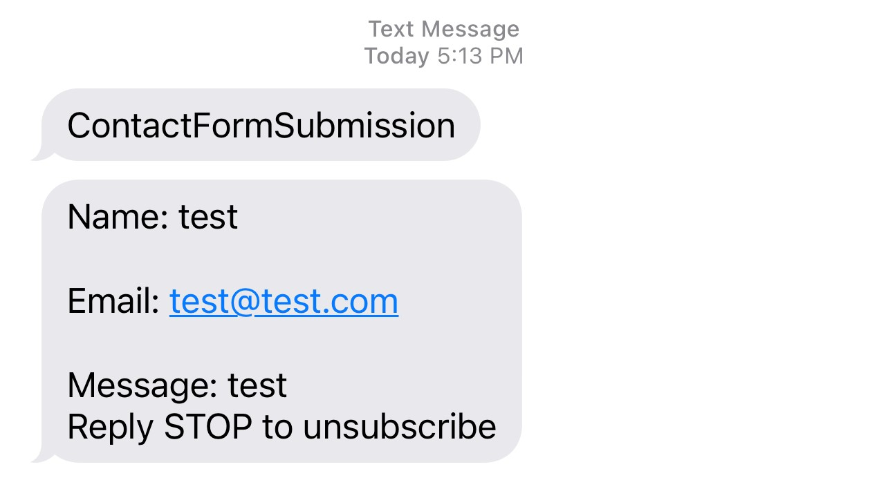

+++
categories = ['Technology']
codeLineNumbers = false
codeMaxLines = 10
date = "2023-04-17T17:46:10-06:00"
year = "2023"
month = "2023-04"
description = ''
draft = false
featureImage = ''
featureImageAlt = ''
featureImageCap = ''
figurePositionShow = true
shareImage = ''
tags = ['featured', 'Hugo', '']
thumbnail = ''
title = "Hugo Netlify Contact Form SMS"
toc = false
usePageBundles = true
+++

This is gonna be a cool post, As you know this site is generated with the Hugo Static Site Generator and the static site is hosted on Netlify for free, If you head over to my [Contact Page](https://techrelay.xyz/contact) there is a Contact Form at the bottom which if you ready my [Netlify VS Cloudflare Pages Post](https://techrelay.xyz/post/netlify-vs-cloudflare) then you will know is a big reason why I have chosen to stay with Netlify for the static hosting portion of things. They make it dead simple to add the form to a static site and store the form contents which is viewable in the portal or send notification via email or webhook which is pretty nifty as well, however I dont always check my email that often and I often turn of email notifications on my Mobile as I get a ton of emails every day.

So I set out to find an alternative that would alert me better, I have long used a service called [Text Belt](https://textbelt.com/) to send SMS notification from my Synology Appliances which has worked great for years but that is really the only thing I have ever used Text Belt for until I figured out I could send a POST via the webhook functionality in netlify notification via a simple https url with a message "ContactFormSubmission" which would alert me to either check my email or login to the portal, this has worked well for a few months until today I thought this could be even better.

So I also use another awesome software called N8N, Like zapier or IFTTT, to build work flows between things, I also pay for IFTT as I dont have to self host that as a backup option, which works awesome if your familiar with it, nodered, zapier, or IFTTT, Then you will understand already how powerful a tool like that can be. 

I noticed that there was an integration for Netlify built into n8n and so I set out to see if I could make that simple pre-defined message actually contain the message and submitter info in the text. After a couple hours of tinkering with it, most of which actually being dealing with the incoming webhook url in n8n which once I fixed that it was more straight forward, I was able to get it to take the trigger from netlify, then run the curl command to send the text, at first this was no different than using the built in webhook functionality of netlify as it was still just sending a pre-defined text message but soon I was able to figure out that I could use expressions in n8n to pull the data being submitted from the webhook into n8n and place those in the message parameter of the curl command. 

End result was I get the Name, Email, Message, and IP address of the submitter all send in a nice pretty message as you can see in the screenshot below showing both the old message format and the new updated one, All in all I think it was worth the hassle to get setup. Once I figured it all out I also set one up to send me a message if the netlify build/deploy fails, which doesnt happen often but sometimes I will fat finger something and the build will fail which unless I am checking my build status page I wouldnt know until I get the delayed email.

If your interested in the workflow to do this for netlify and want to set it up for yourself let me know in the comments and I will do a detailed write up on it. 

So long and Thanks for all the Fish!

