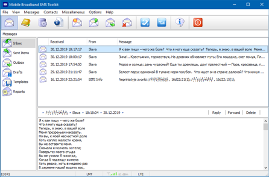

+++
categories = ['Technology', 'Digital Nomad', 'Featured', 'Pinned', 'Travel']
codeLineNumbers = false
codeMaxLines = 10
date = "2023-04-16T17:20:55-06:00"
year = "2023"
month = "2023-04"
description = ''
draft = false
featureImage = ''
featureImageAlt = ''
featureImageCap = ''
figurePositionShow = true
shareImage = ''
tags = ['featured', 'tech', 'Digital Nomad', 'Travel', 'Pinned']
thumbnail = ''
title = "SMS on Windows"
toc = false
usePageBundles = true
weight = 5
+++

I have mentioned before that I carry two laptops with me, Among other devices, A Dell E5570 with dock that generally stays at "home" while I have an E7470 for on-the-go as its much lighter and has the same functionality, Smartcard reader, fingerprint scanner, SD-Card reader, WWAN but weighs half as much!

So both laptops support adding a WWAN card, there's several options including one with support for eSIM which is pretty cool. So anyway I have the WWAN LTE card installed in my e7470 with a T-Mobile unlimited sim, it worked out of the box with the drivers included for the WWAN card however unlike a lot of over carriers T-Mobile does not seem to have a windows application specifically one that supports using SMS, For me this is kind of a big deal because with my Nighthawk Hotspot, my spritz AX I have in the Car as my Stationary car access point, and my T-Mobile home internet hotpot I have as a portable backup access point in the car that can be taken out of the car, all support SMS via either an app or web page like pretty much any hotspot or cellular gateway on the market but windows seems to be another story as I have only ran into a few carriers that had dedicated windows applications for SMS and T-Mobile is not one of them.

Some carriers seem to have neglected to think or care about this aspect and thus lack native applications from the carrier to send SMS or another case is someone like myself that when traveling will buy local sims for data and thus may be constantly switching carriers might have to have many applications installed just to use SMS so I started looking and was surprised to find a carrier agnostic SMS application for windows, I have tested it both on windows 10 and windows 11 with the Dell WWAN card in my e7740 and it works great. 

The application is called [Mobile Broadband SMS Toolkit](http://awx.black-it.eu/en/software/mobile%20broadband%20sms%20toolkit/index.htm), its very small and lightweight, is carrier agnostic and looks to support a large variety of WWAN modems and Carriers. I highly recommend checking it out if you use a WWAN card and SMS on a regular basis, For me this will replace all the carrier apps I have with just one no matter where I am at or what carrier I am using at the time which is a big win in my book! 

The [Bypass Mobile Hotspot Limits on Windows](https://techrelay.xyz/bypass-mobile-hotspot-windows/) post goes great with a WWAN card if your on a limited plan or a plan that is unlimited but limits hotspot which data coming from a WWAN card on a windows machine is going to show up as hotspot on many carriers but not on others so your milage may very, Its work keeping a copy of the bat file on your machine if your often switching carriers while traveling abroad. 

Let me know what you use when your at home and abroad in the comments below or head over to the [Forums](https://forum.techrelay.xyz/)

So long and Thanks for all the Fish!

