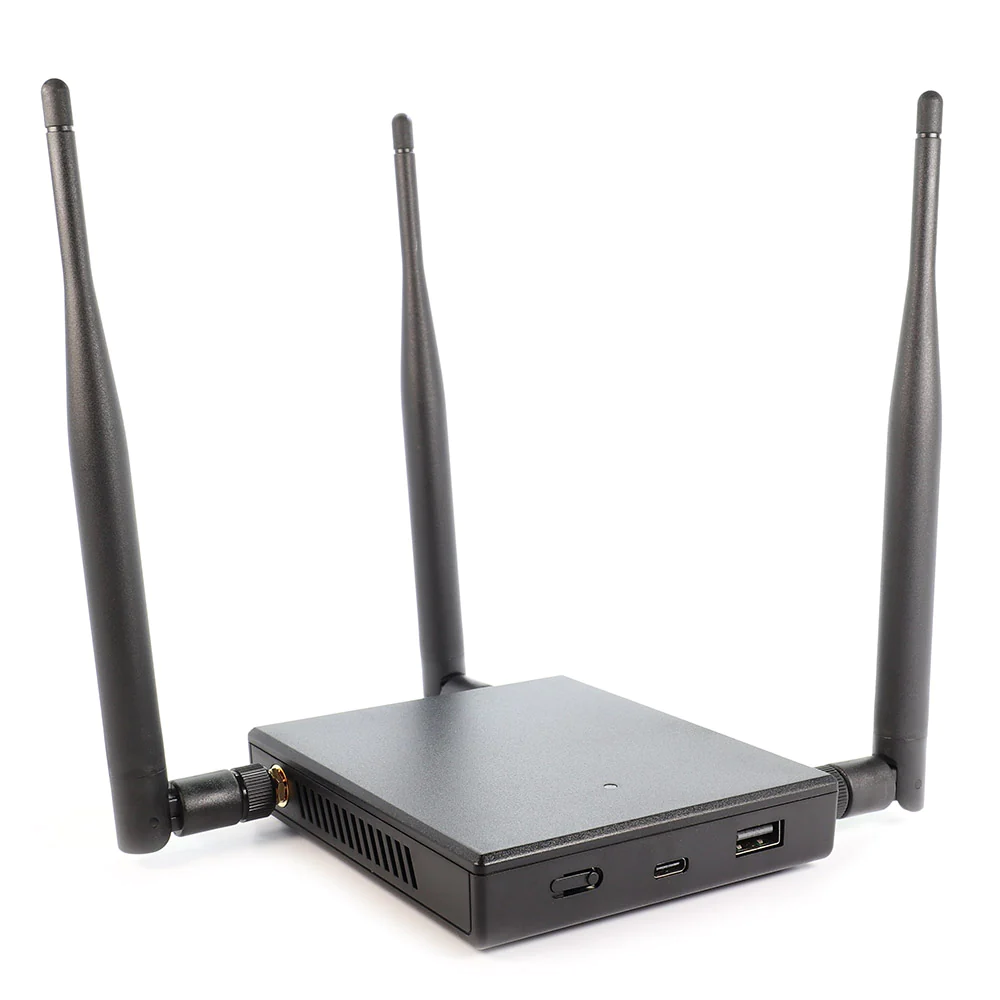

+++
categories = ['Technology']
codeLineNumbers = false
codeMaxLines = 10
date = "2023-04-19T22:10:18-06:00"
year = "2023"
month = "2023-04"
description = ''
draft = false
featureImage = ''
featureImageAlt = ''
featureImageCap = ''
figurePositionShow = true
shareImage = ''
tags = ['featured', 'Penetration', 'Security']
thumbnail = ''
title = "WiFi Pineapple on Slate AR750S"
toc = false
usePageBundles = true
+++

Alright so with the Original Slate coming up on End of Life, and since I had long since replaced it with a Slate AX, I was looking for neat uses I could repurpose the hardware into as its still a really decent device! While I was hunting Github I came across [This Repository by xchwarze](https://github.com/xchwarze/wifi-pineapple-cloner) with ported firmwares of Pineapple-Wifi Cloner for a large number of devices including a bunch of GL-inet devices like the AR750 (Creta) and AR750S (Original Slate) so I set out to see if I could get it to work.

After an hour or so of tinkering with it and several factory resets via Uboot (one of my favourite things about the GL-inet devices is that they have great recovery options, I have never had to worry about bricking my device as Uboot always seems to work) I was able to get the firmware loaded and get logged into the web panel.

I will go over how to get the firmware for the AR750S and then how to upload it properly, access the portal and then your off to the races!

1. Download the firmware for the AR750S [Here](https://github.com/xchwarze/wifi-pineapple-cloner-builds/raw/main/releases/gl-ar750s-universal-sysupgrade.bin) or if your using a different device go [Here](https://github.com/xchwarze/wifi-pineapple-cloner-builds) for the full list of devices and their associated firmware's.
2. For the AR750S you need to hold the reset button the side with the power unplugged, While still holding the reset button plug it back into power, The 5g light will flash 5 times and then release the button.
3. Configure your computer's Ethernet with an IP address of 192.168.1.2, Subnet mask of 255.255.255.0, leave the gateway blank. 
4. Connect the Ethernet cable from your Computer to the LAN port of the AR750S (Slate) and open a browser and go to 192.168.1.1, You should see the uboot page. 
5. Click the upload firmware button and select the wifi-pineapple firmware we downloaded from the link above and click update firmware. 
6. Wait for the confirmation page to show, it will say you can close this page, close the page.
7. Go back to ethernet settings and set it back to DHCP. 
8. Wait a few minutes for the firmware to finish, the lights on the front should change. 
9. open another browser tab and go to http://172.16.42.1:1471/ and follow the prompts, You now have wifi-pineapple installed and ready to go. 

Once I figured out that I needed to use Uboot (The instructions say to use SSH but that didn't work for me either although I may not have waited long enough on that first try however this method above I was able to reproduce several times.) It was smooth sailing so dont try to use the LUCI Admin interface firmware upgrade/flash option because it seems to get stuck but it may have just been a fluke so YMMV but I was easily able to reset to the original firmware with Uboot when that didn't work for me so feel free to test it and report back in the comments below. 

Here is a picture of the Original WiFi-Pineapple Hardware that this firmware is a clone from.

So long and Thanks for all the Fish!