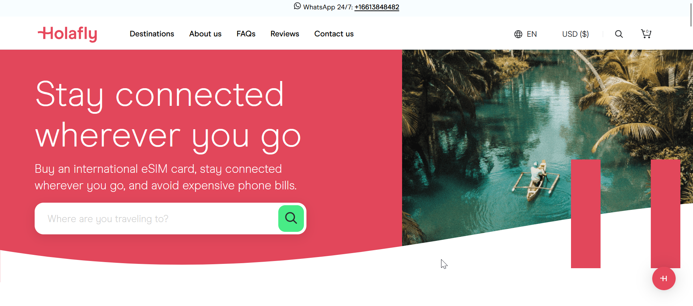

+++
categories = ['Technology', 'Featured', 'Pinned', 'Digital Nomad']
codeLineNumbers = false
codeMaxLines = 10
date = "2023-04-14T10:44:43-06:00"
year = "2023"
month = "2023-04"
description = ''
draft = false
featureImage = ''
featureImageAlt = ''
featureImageCap = ''
figurePositionShow = true
shareImage = ''
tags = ['featured', 'Pinned', 'tech', 'Digital Nomad']
thumbnail = ''
title = "Digital Nomad VPN Hardware"
toc = true
usePageBundles = true
series = 'Digital Nomad'
weight = 3
+++

## Preface

Okay so in the [Digital Nomad VPN](https://techrelay.xyz/nomad-vpn) Post I said I would do an update with hardware choices, I finally have gotten around to it and in that time GL-inet has released some awesome upgraded hardware. I will also cover other brands but I need to do more research and testing (If you have a brand you want tested and reviewed for compatibility and quality head over to the [Contribute Page](https://techrelay.xyz/contribute) to donate funds to purchase specific hardware or head to the [Contact Page](https://techrelay.xyz/contact) to reach out if you have hardware to donate)

## Introduction

Alright so in part one of this post I will cover the new options for GL-inet hardware, We will start be mentioning that the [Flint](https://www.gl-inet.com/products/gl-ax1800/) is still the best option if you are or are not replacing your existing router but there is now a better option if you are just adding this in addition to an existing router and that is the [Brume 2](https://www.gl-inet.com/products/gl-mt2500/) that I will cover below, it has a unique feature that could be useful to some as well as another option for replacing your existing router with something better and that is the [Velica](https://www.gl-inet.com/products/gl-b2200/) which I will also cover below. 

## Hardware

Lets get started on covering the hardware options, we will cover the existing hardware recommendations from the original post as well as new upgraded versions of hardware and some new options that were not available or viable at the writing of the [Original Post](https://techrelay.xyz/nomad-vpn)

### HomeRouter

(The HomeRouter is the hardware that stays in your home nation and is the endpoint for your TravelRouter and other devices)

So in the original post the recomended HomeRouter option is the [Flint](linkhere) and that is still the case *if you are not replacing your exisiting router with the HomeRouter and you don't need the **VPN Cascading** feature that I mention in the Brume 2 section* but there is a new option called the [Brume 2](https://www.gl-inet.com/products/gl-mt2500/) lets cover it in detail.

#### Flint (Reccomended HomeRouter)

**This is the Reccomended HomeRouter as long as you don't have special requirements like Mesh**

The [Flint](https://www.gl-inet.com/products/gl-ax1800/) is the best HomeRouter option GL-inet offers currently, this is the same one recommended in the Original post in this series, it has not gotten a refresh since the original post as of the time of this post.

The Flint is awesome, its got WiFi-6, 5 Ethernet ports (1 Gigabit WAN and 4 Gigabit LAN), and like pretty much everything from GL-inet, a USB 3.0 port, as well as 4 beefy external antennas, It also has a chipset capable of handling routing for Gigabit networks no problem (Some other brand struggle here if your connection is 1gbps). 

All in all its a great choice and highly recommended as long as you don't need mesh (You want the Velica below for that)

#### Brume 2

[Brume 2](https://www.gl-inet.com/products/gl-mt2500/) is a newer offering from GL-inet and its got a cool new feature called *VPN Cascading*, it can run both OpenVPN and Wireguard at the same time (This is by itself nothing new, the flint will do this too) with the added functionality of being able to transfer traffic between the two. For example you can have the OpenVPN connecting to a corporate VPN and then connect your TravelRouter and Work Device to the Wireguard endpoint and pass that traffic onward to the OpenVPN side of things, this could be very useful for someone who's company uses OpenVPN but doesn't enforce the Always-On functionality or enforce the use of the application on the device which may not be all companies but at least some will be this lenient.  

Setup for this device would be mostly the same except for an added part of configuring the Secondary Interface with your OpenVPN config which I will cover in yet another update post. 

#### Velica

This is an awesome addition and also brings [Mesh] Functionality to the HomeRouter offerings of GL-inet which is a nice tide considering all the major manufacturers offer a Mesh offering if not several. 

The [Velica](https://www.gl-inet.com/products/gl-b2200/) is honestly a pretty awesome addition to the GL-inet line up, Its got both Wireguard and OpenVPN like all the others along with some new features like Mesh networking (click the link above to read more about mesh but basically you can add as many "Nodes" and you need to fill the squarefootage of your dwelling and the network is self organizing) as well as support for both Adguard Home and Cloudfalre DNS over TLS which is a huge deal for privacy and security! It also features a large onboard flash storage (8gb which is huge considering most other router storage options) however it has a small downside that is really not a big deal and is very on par with other Mesh capable router systems and that is its only got 2 Ethernet ports, 1 WAN and 1 LAN (this is easiliy remedied by adding an unmanaged or managed switch into the mix, however I will not be covering that because that is not Digital Nomad specific thus there should be tonnes of resources on uncle google to get you going) 

All in all I highly recommend this option if your considering replacing your existing router and have a large house or could otherwise benefit from mesh however I still suggest the [Flint](https://www.gl-inet.com/products/gl-ax1800/) for either full replacement or adding to your existing router or [Brume 2](linkhere) if your not considering replacing your existing router and just want to add the functionality needed for [Digital Nomad VPN](https://techrelay.xyz/nomad-vpn) or need VPN cascading.

### Travel Router

(The TravelRouter is the piece of hardware that you take with you on your travels and connects to the VPN endpoint on the HomeRouter)

For this section the original recommendation was the [Slate](https://www.gl-inet.com/products/gl-ar750s/) and honestly its still a great option as its much cheaper than the newer offerings but if you don't mind spending the extra money the newer [Slate AX](https://www.gl-inet.com/products/gl-axt1800/) is a better choice along with some others I will cover below. 

#### Slate AX (Recommended TravelRouter)

**This is the Recommended TravelRouter if you don't have any special requirements like 2.5Gbps WAN**

The [Slate AX](https://www.gl-inet.com/products/gl-axt1800/) is a awesome upgrade to the already awesome Slate series and although it comes with a higher price tag its very worth it. 

First its been upgraded to WiFi-6 like the Flint and the Velica which is a nice addition as more devices are starting to have WiFi-6 chipsets and can benefit from the increased throughput and reduced latency.Second it ships with a much newer version of the firmware which is nice as it cuts down on initial setup time, especially if you have to replace a TravelRouter while your abroad as we all know shit happens and you may need to replace one on the quickness. 

It also has DFS Certification in US, UK, Europe & Japan which allows it to use bands that are normally off limits or reserved for things like sat coms or military use and this is an awesome addition as it can help in highly congested areas. 

I highly recommend upgrading from the original Slate if you have one or choosing this as your starting point if your just getting setup if you can afford the additional cost however like I said the original [Slate](https://www.gl-inet.com/products/gl-ar750s/) is still very viable and a more afforadable option even though its Discontinued (You may not be able to find it directly from GL-inet like you can the others so you may have to buy it from a reseller or second hand off something like ebay.)

#### Slate Plus

The [Slate Plus](https://www.gl-inet.com/products/gl-a1300/) is another new addition, It is a cheaper version of the Slate but upgraded from the original [Slate](https://www.gl-inet.com/products/gl-ar750s/) from the first post in this series. If you don't want to spend upwards of $100 for the [Slate AX](https://www.gl-inet.com/products/gl-axt1800/) then you can opt for the Slate Plus since the Slate will be harder to find now that its entered EoL. 

The slate plus has most of the same functionality as the Slate AX albeit just slower WiFi speeds as its not WiFi-6 as well as slightly slower (too negligible to list as a con) Wireguard speeds due to the slower processer chipset, all in all its a great choice to get started if you don't want to spend as much up front to get going and remember you can always upgrade at anytime. Either sell the old one of keep it as a backup for emergencies. 

#### Beryl AX

The [Beryl AX](https://www.gl-inet.com/products/gl-mt3000/) is another really awesome improvement to an existing line and this one could be the killer choice if you can live without the 3rd ethernet port that the Slate AX has however you would be gaining a 2.5gbps Ethernet WAN port at the expense of that 3rd ethernet port which could be super useful for someone traveling in countries with super fast ethernet like Japan or Switzerland. 

This is honestly a huge upgrade over the Slate AX in all aspects except Ports, It has a faster processer SoC as well as more NAND Storage (256MB vs the 128MB in the Slate AX, although this is not really a big deal because you can put an SDXC micro-SD in it to expand) as well as faster memory (DDR4 vs the DDR3 that's in the Slate AX). It also has a faster 5ghz WiFi band (2402Mbps vs the 1200 Mbps of the Slate AX but a slightly slower 2.4ghz band at 574Mbps vs the 600Mbps of the Slate AX, just remember that in order to get above 1200Mbps on the Beryl you have to be connected to a 2.5gbps modem) 

All in all I would say this is the choice if your going to be around Ethernet connections above 1Gbps to utilize the 2.5gpbs port or you can live without the 3rd ethernet port that you would get on the Slate AX just to get the improved hardware of the Beryl, Otherwise you should stick with the Slate AX as the recommended TravelRouter. 

### Mobile 4G/5G/LTE Routers

So in this section we will cover something new to this series and that's Mobile Cellular Routers, These are going to be useful for both your Personal Devices as well as your Work Devices if you ever get in a pickle and need internet access (The awesome thing about these is that they support wireguard so you can access your Digital Nomad VPN without the need for extra hardware like your TravelRouter in the even that your only connectivity is cellular and you either don't have a [Nighthawk Pro M6 Mobile HotSpot](https://www.netgear.com/home/mobile-wifi/hotspots/mr6500/) or you want to simplify your hardware setup and ditch having to carry the Nighthawk which doesnt support wireguard thus you need to couple it with the travel router as well to get the same functionality however I personally carry a Slate AX, a Backup Slate, a Mundi AND two non-GL-inet devices the afformened Nighthawk and the Mogo S2 e-Sim Cellular Hotspot but I like to be prepared haha)

#### Mundi

The [Mundi](https://www.gl-inet.com/products/gl-e750/) is an awesome piece of hardware, It supports 4G LTE and has a decent list of supported bands so like the Nighthawk, which doesn't support cellular, should work in most countries/regions you might find yourself in. 

It also supports Wireguard just like all the other devices I have mentioned (sans Nighthawk as I believe it only supports OpenVPN and only on the newer hardware revision with the updated firmware IIRC) so it is able to connect directly to your HomeRouter VPN endpoint which is a reason I carry it on top of my Nighthawk + Slate AX. 

Again this another must have on my personal list of hardware, Highly recommend you pick one up as it takes a standard micro-sim that you should be able to find pre-paid providers in any country you visit. 

#### Mogo S2 eSIM 

The [Mogo S2](https://ifreemogos.com/en/products/mogo-s2.html) is not made by GL-inet and is one of the few reccomedations I have for hardware not made by GL-inet. It is awesome but to be honest I only carry one for simplicity and convinece, theres nothing aside from being e-Sim capable (hence the simpilicty and convinece part) that the Nighthawk or Mundi cant do and thus this is an optional option for hardware thus I don't reccomend you pick one up unless you just like to be prepared or the e-Sim functionality is important to you (for me its both).

#### eSUNFI eSim/Physical Sim Combo

The [eSUNFI](https://www.esun-fi.com/) (*Warning this website sucks ass*)  This one is really interesting and I have heard some good things about it but yet to try it, Someone reached out with one to donate for review so as soon as I get it in hand I will update this post with a full review but so far it looks really promising as it has both a physical sim slot and eSim functionality which for me is a huge deal, if it supports using any eSim (the Mogo S2 above doesnt support a bring your carrier style, you have to purchase esim service from their shop which only has their partnered carriers) and its got decent performance like the nighthawk this device might replace two devices I don't generally leave home without.

#### Nighthawk M6 Pro (This is the Recommended Hotspot)

**This is the Recommended Hotspot if you choose to carry one.**

The [Nighthawk M6 Pro (MR6500)](https://www.netgear.com/home/mobile-wifi/hotspots/mr6500/) is a must have for me, On my personal devices I don't always use a TravelRouter as I have multiple VPN endpoints at home thus I normally just connect to the Hotspot when I am out and about because my Personal Laptop has always on built in VPN via my Enterprise SonicWALL Firewall, So having a good hotspot that also has ethernet is killer. This device has it all, 2.5Gbps Ethernet WAN, WiFi-6, 5G LTE and if you buy the [MR6150](https://www.netgear.com/home/mobile-wifi/hotspots/mr6150/) variant you can use an external antenna which is a huge plus for a mobile hotspot!

All in all if your going to carry a hotspot also then this is the one! You want either the [MR6500](https://www.netgear.com/home/mobile-wifi/hotspots/mr6500/) or the [MR6150](https://www.netgear.com/home/mobile-wifi/hotspots/mr6150/) for the ability to use an external antenna

## Bonus

Here are a couple bonuses I thought were interesting, I have not had a chance to use it yet but I did find many Digital Nomad and Travel resources that had good reviews for this service. As well as another Bonus Hardware option.

### HolaFly eSim

[HolaFly eSim Serivce](https://esim.holafly.com/?ref=drinkteatravel&utm_source=drinkteatravel&utm_medium=afiliacion) is a platform to purchase and use eSim cellular service world wide, they offer competitive pricing and what looks to be a simple process. I will update this with a personalized review once I get an opportunity to test it out. 

### Spritz AX 4G/5G Cellular Gateway

[Spritz AX](https://www.gl-inet.com/products/gl-x3000/) is an awesome Dual-Sim 4G/5G Cellular Gateway, This is the opposite of the category above for Mobile Cellular Routers, This does not have a battery and is not meant to be "mobile or portable" however it has great use! If your like me and travel a lot both inside my home nation and abroad then this might be of use to you in a vehicle or RV. I currently have one in my car but I plan to put a second one in the RV once we find the right one and start our Full Time RV Journey thus I thought I would mention it. Its a powerful Cellular router that works great in my car to give me reliable 5g access anywhere I have a signal.

## Closing 

I hope this was a useful post and that I was able to give you a better understanding of your hardware options as well as covering the upgrades available to you, I will continue to add more content to the [Digital Nomad Series](https://techrelay.xyz/series/digital-nomad/) as I come across things and have the time to create content so check back often!

Let me know your thoughts or questions in the comments below or head over to the [Forums](https://forum.techrelay.xyz) to discuss these digital nomad topics and more!

So Long and Thanks for all the Fish!