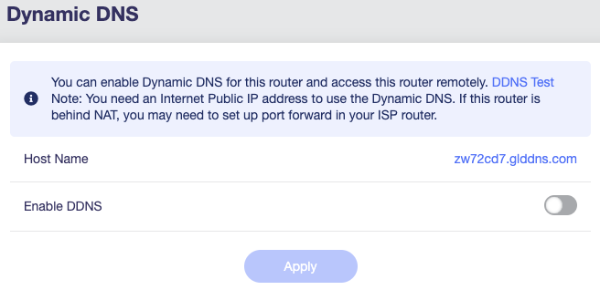
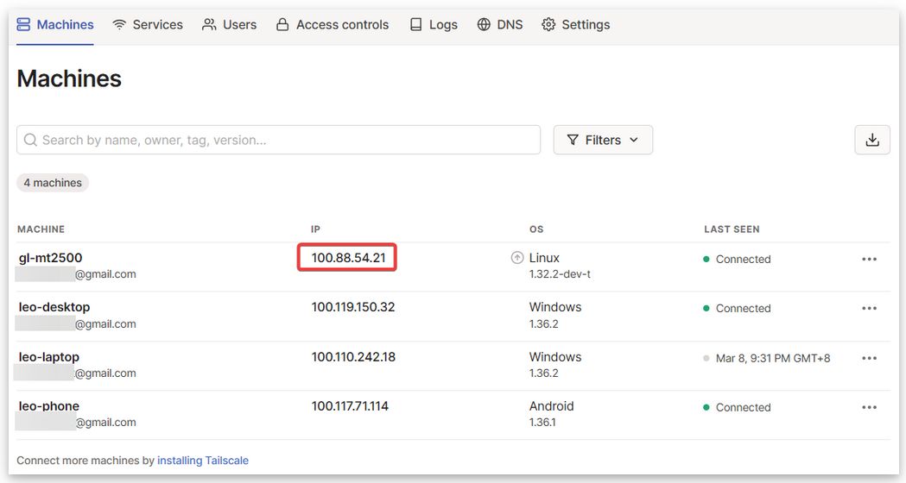

+++
author = 'Nicholas Bennett'
date = '2022-06-08T02:58:03Z'
year = "2022"
month = "2022-06"
description = ''
draft = false
series = 'Digital Nomad'
slug = 'nomad-vpn'
tags = ['featured','Tech','Digital Nomad','Pinned']
title = 'Digital Nomad VPN Setup'
weight = '1'
categories = ['Digital Nomad','Pinned']
toc = true
+++
## Preface
Alright so I was browsing Reddit and came across a post in the digital nomad sub asking about covering up your location when working abroad and thus I was compelled to do this write up and actually ended up deciding to do a whole series on DNing, Starting with how to setup your travel router, vpn, kill switch, etc... 

So lets get started. 

## Introduction

First of all lets discuss some pre-reqs that you must have or before you start this guide 

[Click Here](https://techrelay.xyz/post/digital-nomad-vpn-hardware/) to go to the ~~upcoming~~ update post talking about the GL-inet hardware if you want more/less features, different use cases, setups with other hardware otherwise Purchase the models mentioned in this guide for a quickstart.

**1. You must have another GL-Inet Router or a Raspi, Old Desktop, Home router, etc... that supports wireguard (openvpn can be used as well albeit at a slower perfomance)**

**2. If your setup does not have wireguard functionality already setup like a turnkey raspi distro, a built in vpn settings in your home router, etc.. then you must setup wg-easy first. (I will Cover This further in this series but for this guide I will assume you bought Two GL-Inet Routers and one will act as the server in your home region while the other goes with you and connects to it.)**

**3. You must have a travel router that you will configure to connect to this vpn and take with you on your travels (you can use a home router too that has support for something like openwrt if you plan to be stationary as well)**

For this Guide I will be using a GL-Inet Flint (GL-AX1800) as the Home region router referred to as HomeRouter in the rest of this guide and a ~~Slate (GL-AR750S)~~ Slate AX (gl-axt1800) as the Mobile travel router referred to as TravelRouter in the rest of this guide. (You can still use the Original Slate if you can find it from a reseller or used on eBay as its by far going to be cheaper than both the Slate AX and Slate Plus, It is still very viable however it will be EoL in 2024 and might stop getting updates. So ultimately I would suggest upgrading to the Slate AX or the Slate Plus at minimum.)

Alright lets get started. 

## HomeRouter Setup

Take the HomeRouter and connect it to the internet, If you already have a router for you home internet (like a DSL modem/router combo or an xFinity gateway, either make sure its in bridge mode so that the HomeRouter is acting as the DHCP server and routing point or if your device does not support bridge mode or you have a nicer router then you will need to port forward to the HomeRouter)

Assuming you have purchased the recommended routers in this guide then you just need to connect a device to the HomeRouter, open a browser and connect to the web portal, For most GL-Inet routers this will be 192.168.8.1 but you should have a little card that comes with it that has the default ip, username and password documented on it. Once you are logged into the portal go to VPN -> WireGuard Server. Click Initialize WireGuard Server

choose the IP address subnet on the next screen. you can leave this as whatever the default is, on mine it was 10.0.0.1, I changed this to 10.0.42.1 (shout out to HHGTTG) but this can really be anything starting with 10.0.x.x (remember only 1-254); If you are wanting to access other things on the network that you will be hosting the wireguard server in, like remote desktop to another machine or access things like file servers, plex, home assistant, etc... then make sure enable the toggle for "Allow Access Local Network" If you dont need this then leave that toggle disabled. 

On that same screen you can set the port that the VPN will connect to. This can be left as the default or if you know that you will be connected to networks with strict outgoing port lockdowns you can set this to something like port 53 (DNS), port 80 (http), port 443 (https) or another common port that is rarely blocked. (*however this is only needed for more complicated setups or if you want to attempt to bypass paid hotspots, I say attempt because it doesn't work for all of them and is becoming less common as most have switched to more advanced ways of detecting, and others are even easier like simply mac spoofing your device but that's a whole other topic in and of itself so I digress lol.*) Whatever PORT you Choose here you must Port Forward to the HomeRouter if it is not the Outer most router in your network. I.E its behind NAT

Next we are going to add a client, This process will be the same for any other clients you might want to create credentials for, like your phone!

Go to VPN -> WireGuard Server -> Management and click Add a New User.

Name the config here, For this Guide since we are setting up this first user for the TravelRouter we will call this config TravelRouter

Back on the management page you will see your user/client on the list. 

Click the little file icon under configurations and it will display the configuration 

Copy the config to a note pad or something for safe keeping until we need it again to setup the TravelRouter as a Client to the WireGuard Server. 

So if you followed along you should now have the HomeRouter connected to the internet, the WireGuard Server Initialized and a Config created for the TravelRouter and now its time to move onto the TravelRouter setup but first You should probably go back through the Client Config creation steps above again and create a config for your phone and use the WireGuard App on iOS or Android to Scan the QR code, use this config to test the connection to your HomeRouter with wifi turned off, if you can Browse the web, Go to https://icanhazip.com and check that the ip address reported is the same as on a computer connected to your home network lan. if you cant browse the internet once its "connected" then its usually one of two things: 

*First is your main router out to the internet is not the HomeRouter and you have another router in front of the HomeRouter that you didn't setup the port forwarding as mentioned in the beginning of this guide. Or your IP address in the Config (called the endpoint) is a LAN address because of reason number 1 (Port Forwarding is not covered in this guide as its a common task, If you need help with this reach out to me on Discord/Matrix and I will help you)*

Edit: I forgot to mention that if your endpoint address is a local one, i.e 192.168.x.x then you need to replace that with the ip that https://icanhazip.com shows otherwise it wont work, you also need to forward whatever port you set on the server config to the IP address of the HomeRouter (this is only applicable to people that have a router in front of the HomeRouter)

## TravelRouter Setup

 With the config you saved from the last part of the guide, Connect to the TravelRouter either via Ethernet or Wifi and navigate to the web GUI (like the HomeRouter it is most likely 192.168.8.1 however yours will come with a card that has all that info)

once logged into the web GUI navigate to VPN -> WireGuard Client and click the button that says Setup WireGuard Manually.

Click on the Configuration Tab and Paste the config in the window

After Clicking Next on the next page Name the connection HomeRouter

and then Click connect on the status page

on that same page you should see an IP Address and an UP/Down Stat. if traffic is flowing here its working and you should be able to view a web page. Test with the device currently Connected to TravelRouter.

If you would prefer a video of this TravelRouter Client part of the setup GLINET has a really good one from their support site linked [here](https://youtu.be/oTrche1jprQ)

At this point you should have the HomeRouter Server running with the TravelRouter and maybe your Phone connected as clients to the HomeRouter Server and you are able to browse the internet! Awesome right? Well there is still one last thing to do, The VPN Internet Kill Switch failsafe.

In the Travel Router Gui navigate to Admin Panel -> VPN -> Internet Kill Switch. Click the Toggle for Enable and Click APPLY

Congrats you have now setup your Wireguard Server on the HomeRouter, Connected the TravelRouter to the VPN and enabled the KILL Switch, Connected a device to the TravelRouter Either via Ethernet or Wifi and you can visit https://icanhazip.com and it shows your HomeRouter's External IP address. 

## Updates

I will add updates to this section here, starting with DDNS and GoodCloud.

### DDNS

Okay so if you login to the admin portal for the HomeRouter, Go to Applications >> Dynamic DNS and click the toggle to enable DDNS, Copy the hostname shown and replace the endpoint ip address in your wireguard config on the TravelRouter with the DDNS URL, This will prevent you from having any issues with Dynamically assigned addresses changing while you are abroad. 

see the screenshots below for examples.

You may also want to enable HTTPS Remote Access to the admin portal, Meaning you can access the admin portal via the DDNS URL. 

see the below screenshot for an example.

If you are comfortable with the Terminal and would also like to access the HomeRouter Via SSH you can also use the DDNS URL by Clicking the Toggle below the HTTP and HTTPS Toggles. 

See the below screenshot for an example. 

### GoodCloud

Another Useful feature of the GL-inet Routers is they Come with a service called GoodCloud, Like the DDNS it allows you to access both SSH and Web Portal remotely however unlike the DDNS this option does not require any port forwarding and thus can be a failsafe if something happens with your DDNS or Portforwarding allowing you emergency access to your HomeRouter to fix whatever issues you may be having. 

Login to the Admin Panel and go to Application >> GoodCloud and click the Toggle for GoodCloud and Remote Web Access. (Also enable SSH if like above with the DDNS config you are comfortable with the terminal and would like SSH access as well.)

See the below screenshot for an example. 

### AdGuard Home

*Only Applicable to the following:* [GL-AX1800 (Flint)](link), [GL-A1300 (Slate Plus)](link), [GL-AXT1800 (Slate AX)](link), [GL-MT3000 (Beryl AX)](link), [GL-MT2500/GL-MT2500A (Brume 2)](link) and [GL-X3000 (Spitz AX)](link).

AdGuard is a Network Wide Ad and Tracking Blocker. Like Pihole, NextDNS, etc... with the above supported models having built in functionality. Go to Applications >> Adguard Home and click the start button.

Once you have clicked the start button you will see a link to the settings page appear, Click that to go to the Adguard Settings Panel. 

From there you may configure Adguard Home as you please. Check back for another standalone post covering Adguard Home, NextDNS(My Personal Choice), Pihole, Etc.. including links to quality blocklists. 

### Tailscale

*Only Applicable to the following:* [GL-AX1800 (Flint)](link), [GL-A1300 (Slate Plus)](link), [GL-AXT1800 (Slate AX)](link), [GL-MT3000 (Beryl AX)](link), [GL-MT2500/GL-MT2500A (Brume 2)](link) and [GL-X3000 (Spitz AX)](link).

**Note: Because Tailscale is based on WireGuard, it is not recommended to use the Tailscale feature with the OpenVPN Client or WireGuard Client at the same time, as there may be bugs. So this feature may only be useful for those that dont require using the vpn to mask their location or those like me that carry an extra TravelRouter for my Personal Devices.**

**Note: This feature is currently in beta, and may have some bugs.**

Tailscale is a VPN service that makes the devices and applications you own accessible anywhere in the world, securely and effortlessly. For more information about [Tailscale, Check out their website](https://tailscale.com/)

If you already have other devices in Tailscale then all you need to do is follow below, otherwise add a few devices first.

Go to Applications >> Tailscale and click the enable Toggle. 

Once you have enabled the toggle you should see the Device Bind Link, Click that

A pop-up will show a link, click that link 

Once logged in, click on connect. 

After connection is successful you can go to you Tailscale machines list and you should now see the GL-inet router listed there. 

You should now be setup with Tailscale, just remember not to run it with the Wireguard or OpenVPN Client at the same time. 

## Closing

I threw this together super fast for the folks on reddit, I will improve this guide when I have a little more time to sit down and knock it out. I will also be adding more in this Digital Nomad Series to cover things like Mobile Internet, Hotspots, Masking data to avoid caps, etc.... 

Check out the other posts in the [Digital Nomad Series Here](https://techrelay.xyz/series/digital-nomad/) and check back for new content!

So long and Thanks for all the fish!

***If this post was helpful to you, please consider donating via the button below. Your donations allow me to purchase hardware and pay for infrastructure which provides me better ability to make content***
 
 
     

