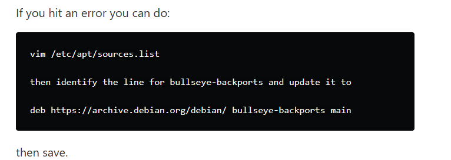

# Skip Port Forwarding: Install Tailscale on a UniFi Dream Machine

Remote access used to mean doing a bunch of things I try very hard to avoid now:

- opening firewall ports
- setting up Dynamic DNS
- maintaining a traditional VPN server
- exposing management interfaces by mistake
- hoping your ISP does not randomly break everything with CGNAT

That old way still works, but it is not how I want to manage a home lab, small office, or client network in 2026.

Tailscale gives you a cleaner option. It uses WireGuard under the hood, but removes most of the pain that usually comes with VPN design. Instead of building tunnels manually, managing certificates, and babysitting firewall rules, your devices join a private Tailnet and securely talk to each other.

The source article that kicked off this guide focused on replacing UniFi Teleport-style access with Tailscale on a UDM, including three practical goals: direct LAN IP access, custom DNS resolution, and exit-node traffic for services that need to think you are at home. That is a solid foundation, but this Tech Relay version goes further: it is written as a deployment guide for people who actually support networks and want the “why,” the commands, the failure points, and the field notes in one place.

By the end, your UniFi gateway can act as a Tailscale router for your network.

That means your laptop, phone, or tablet can reach internal devices like:

```text
192.168.1.116
192.168.10.25
192.168.42.15
```

without exposing those devices to the internet.

## What This Setup Solves

Installing Tailscale on a single laptop is useful.

Installing Tailscale directly on the UniFi gateway is more powerful.

When Tailscale lives on the gateway, it can provide secure access to things that cannot run Tailscale themselves:

- NAS devices
- Proxmox hosts
- IP cameras
- printers
- Home Assistant
- media servers
- lab VMs
- management interfaces
- IoT devices
- old appliances with web UIs
- internal-only dashboards

This is the difference between “I can reach one computer remotely” and “I can reach the network like I am sitting there.”

For a home lab, that is convenient.

For small business support, that can be the difference between fixing something in five minutes and driving across town.

## Why Not Just Use UniFi Teleport?

UniFi Teleport is fine for basic remote access, especially from mobile devices. It is easy and built into the UniFi ecosystem.

Tailscale is different because it is not just a UniFi feature. It is a full mesh networking platform that can work across laptops, phones, servers, cloud VMs, routers, and multiple sites.

Tailscale makes more sense when you want:

- access from non-UniFi-managed devices
- subnet routing to multiple internal networks
- consistent access across multiple locations
- exit-node functionality
- ACL-based control
- MagicDNS or custom DNS behavior
- the ability to connect devices across NAT and CGNAT
- secure access without opening inbound firewall ports

Teleport is a convenience feature.

Tailscale is infrastructure.

## Supported UniFi Devices

The community installer used in this guide is the SierraSoftworks Tailscale on UniFi OS project. The project is designed to run Tailscale on UniFi OS devices and provides a persistent service using UniFi OS mechanisms. The current repository is named `tailscale-unifi`, though older references and commands may still mention `tailscale-udm`.

The project documentation says it is compatible with UniFi OS 2.x or later and covers UniFi Cloud Gateway, Control Plane, Independent Gateway, Next-Gen NVR, and Next-Gen Storage families, with some device classes using userspace networking mode depending on kernel support.

Common targets include:

- UniFi Dream Machine
- UniFi Dream Machine Pro
- UniFi Dream Machine SE
- UniFi Dream Router
- UniFi Cloud Gateway models
- UniFi OS 2.x, 3.x, and newer supported devices

It is not for the old USG line or UniFi OS 1.x legacy setups.

## Before You Start

You need:

- a UniFi OS gateway
- SSH access to the UniFi console
- a Tailscale account
- admin access to the Tailscale console
- your LAN subnet or VLAN subnet list
- a few minutes of maintenance time

Do this from the local network if possible. If you are doing routing changes over a remote session, assume you can lock yourself out if you advertise the wrong routes or reset the wrong interface.

## Step 1: Enable SSH on the UniFi Console

In the UniFi console, enable SSH.

The location may vary slightly by firmware version, but the source workflow is:

```text
Control Plane > Console > SSH
```

Enable SSH and set the credentials.

Then connect from your computer:

```bash
ssh root@YOUR_UDM_IP
```

Example:

```bash
ssh root@192.168.1.1
```

If your UniFi console uses a different management IP or VLAN, use that address instead.

## Step 2: Confirm UniFi OS Version

Before installing, check the UniFi OS version:

```bash
/usr/bin/ubnt-device-info firmware_detail
```

You mainly want to confirm that you are on UniFi OS 2.x or newer.

You can also grab some basic info for your notes:

```bash
ubnt-device-info summary
```

I like saving the device model and firmware version before making changes. It makes troubleshooting easier later if an update changes behavior.

## Step 3: Install Tailscale on UniFi OS

Run the installer from the SierraSoftworks project:

```bash
curl -sSLq https://raw.githubusercontent.com/SierraSoftworks/tailscale-unifi/main/install.sh | sh
```

Older guides often use this path:

```bash
curl -sSLq https://raw.github.com/SierraSoftworks/tailscale-udm/main/install.sh | sh
```

The project has moved to `tailscale-unifi`, so use the newer command unless you have a specific reason not to.

After installation, start authentication:

```bash
tailscale up
```

The terminal will show an authentication URL.

Open it, log in to Tailscale, and approve the UniFi device.

Then verify status:

```bash
tailscale status
```

You should see the UniFi gateway listed in your Tailnet.

## Important: Bullseye Backports Repository Error

This is the fix you do not want buried at the bottom of the post.

On some UniFi OS builds, the installer may fail because the Debian Bullseye backports repository has moved or is no longer available from the expected mirror. The source blog specifically calls out this newer UniFi update issue, and the screenshot below shows the exact kind of fix people are running into.



If the installer fails around `bullseye-backports`, edit the apt sources file:

```bash
vim /etc/apt/sources.list
```

Find the `bullseye-backports` line and update it to:

```text
deb https://archive.debian.org/debian/ bullseye-backports main
```

Save the file.

Then rerun the installer:

```bash
curl -sSLq https://raw.githubusercontent.com/SierraSoftworks/tailscale-unifi/main/install.sh | sh
```

Then bring Tailscale up again:

```bash
tailscale up
```

This is not really a Tailscale problem. It is a repository availability problem. The installer needs packages, and UniFi OS is still tied to Debian package sources under the hood.

## Step 4: Patch DNS Behavior on tailscale0

The source article also points out a DNS issue that can show up after install. If your Tailscale connection works but local DNS names do not resolve, add `tailscale0` to dnsmasq’s interface config.

Create the config file:

```bash
touch /run/dnsmasq.dhcp.conf.d/tailscale0.conf
```

Edit it:

```bash
vim /run/dnsmasq.dhcp.conf.d/tailscale0.conf
```

Add this line:

```text
interface=tailscale0
```

Save the file.

Then restart dnsmasq:

```bash
pkill dnsmasq
```

If DNS still does not behave, force it:

```bash
killall dnsmasq
pgrep dnsmasq
```

`pgrep dnsmasq` should return a process ID after it restarts.

Field note: if DNS works, then stops after a reboot, revisit this section. Depending on UniFi OS behavior and updates, runtime files under `/run` may not survive the way you expect.

## Step 5: Advertise Your LAN Subnet

This is where the setup becomes useful.

If your main LAN is `192.168.1.0/24`, advertise it:

```bash
tailscale up --advertise-routes=192.168.1.0/24
```

Then go to the Tailscale admin console and approve the advertised route for the UniFi machine.

After approval, your Tailscale devices can reach that subnet.

For example, from your laptop while remote:

```bash
ping 192.168.1.116
```

If that device has a web UI:

```text
http://192.168.1.116
```

That is the core win.

No port forwarding.

No public exposure.

No “temporary” firewall rule you forget about for three years.

## Step 6: Advertise Multiple VLANs

Most Tech Relay readers are not running a flat single-subnet network.

If you have VLANs, advertise the ones you actually want reachable over Tailscale.

Example:

```bash
tailscale up --advertise-routes=192.168.1.0/24,192.168.10.0/24,192.168.42.0/24
```

A more complete example might look like this:

```bash
tailscale up \
  --advertise-routes=192.168.1.0/24,192.168.10.0/24,192.168.42.0/24 \
  --advertise-exit-node
```

Then approve the routes in Tailscale.

Do not blindly advertise every VLAN.

For example, you may not want your guest network or untrusted IoT network reachable from remote clients. Only advertise what you need.

A sane approach:

| Network | Advertise? | Why |
|---|---:|---|
| Main LAN | Yes | Normal admin access |
| Server VLAN | Yes | Proxmox, NAS, dashboards |
| Management VLAN | Maybe | Only if ACLs are locked down |
| IoT VLAN | Usually no | Keep noisy/untrusted devices isolated |
| Guest VLAN | No | No reason to expose it remotely |

## Step 7: Use Local DNS Names Remotely

IP access is good.

DNS access is better.

The source article’s goal was to access custom router DNS entries like:

```text
my.media
my.photos
```

The Tailscale-side fix is to configure DNS in the Tailscale admin console.

Go to:

```text
Tailscale Admin Console > DNS
```

Then configure DNS to use the UniFi router as the resolver.

Depending on your Tailscale console layout, this may be under global nameservers or DNS override behavior.

Use your UniFi gateway IP, for example:

```text
192.168.1.1
```

After that, remote Tailscale clients should be able to resolve local names that your UniFi gateway knows about.

Test from a remote client:

```bash
nslookup my.media
```

or:

```bash
ping my.media
```

If IP access works but DNS names do not, your issue is DNS, not Tailscale routing.

## Step 8: Enable the UniFi Gateway as an Exit Node

An exit node routes internet traffic from your remote device through your UniFi network.

That is useful when:

- you are on sketchy public Wi-Fi
- you want traffic to appear from your home or office IP
- an app only works when it thinks you are at home
- a service is IP allowlisted to your site
- you want one-click “route everything through home” behavior

Enable exit-node advertisement:

```bash
tailscale up --advertise-exit-node
```

If you also need routes, combine options:

```bash
tailscale up \
  --advertise-routes=192.168.1.0/24 \
  --advertise-exit-node
```

Approve the exit node in the Tailscale admin console.

Then from your client device, choose the UniFi gateway as the exit node.

## Step 9: A More Complete Command for Real Deployments

For a more complete deployment, especially if you want subnet routing and exit-node behavior together:

```bash
tailscale up \
  --advertise-routes=192.168.1.0/24,192.168.10.0/24,192.168.42.0/24 \
  --advertise-exit-node
```

For advanced routing where LAN devices need to initiate traffic toward Tailnet endpoints, review the current SierraSoftworks documentation. The project documents newer support for routing traffic from local network machines to Tailscale endpoints and includes options such as:

```bash
tailscale up \
  --advertise-exit-node \
  --advertise-routes="10.0.0.0/24" \
  --snat-subnet-routes=false \
  --accept-routes \
  --reset
```

Do not copy that blindly unless you understand the routing goal.

For most people, basic advertised subnet routes are enough.

## Verify the Tailscale Interface

Check that `tailscale0` exists:

```bash
ip link show tailscale0
```

You should see an interface named `tailscale0`.

If it does not exist, you may be in userspace networking mode or dealing with an older install path. The SierraSoftworks documentation specifically calls out that older installs may have used userspace networking mode, which is not what you want for normal subnet routing.

Check Tailscale status:

```bash
tailscale status
```

Check routes:

```bash
ip route
```

Check service status:

```bash
systemctl status tailscaled
```

Restart Tailscale if needed:

```bash
systemctl restart tailscaled
```

## Upgrade Tailscale Later

The SierraSoftworks project documents two update approaches.

Using apt:

```bash
apt update && apt install -y tailscale
```

Using the helper script:

```bash
/data/tailscale/manage.sh update
```

If you are connected over Tailscale and need the update to continue after the session drops, the project also documents:

```bash
nohup /data/tailscale/manage.sh update!
```

I would avoid doing remote updates casually unless you have another way back into the site.

## Remove Tailscale

If you need to remove it:

```bash
/data/tailscale/manage.sh uninstall
```

For production or client environments, document the device name in Tailscale, the approved routes, and any DNS settings before removal.

## Troubleshooting Checklist

### Installer fails immediately

Check internet access from the UniFi gateway:

```bash
ping 1.1.1.1
```

Check DNS:

```bash
nslookup github.com
```

If repository errors mention Bullseye backports, apply the archive fix above.

### Authentication URL does not appear

Try:

```bash
tailscale up --reset
```

Then rerun:

```bash
tailscale up
```

### Device shows in Tailscale but LAN IPs do not work

Confirm you advertised the subnet:

```bash
tailscale status
```

Then confirm the route is approved in the Tailscale admin console.

Also verify that the client has accepted routes. Some platforms have a “use subnet routes” or equivalent setting.

### IPs work but DNS names do not

This is DNS.

Check the Tailscale admin console DNS settings.

Then apply the `tailscale0` dnsmasq patch:

```bash
touch /run/dnsmasq.dhcp.conf.d/tailscale0.conf
echo "interface=tailscale0" > /run/dnsmasq.dhcp.conf.d/tailscale0.conf
pkill dnsmasq
```

### Exit node connects but internet breaks

Try DNS first.

Set a known-good resolver temporarily in Tailscale DNS, such as Cloudflare or Google, and test again. If internet starts working, the tunnel is fine and DNS is the problem.

### Routes disappear after reboot

Check service status:

```bash
systemctl status tailscaled
```

Then re-run your preferred `tailscale up` command.

If you had to patch `/run/dnsmasq.dhcp.conf.d/tailscale0.conf`, remember that `/run` is runtime storage and may not persist across reboot.

## Security Notes

Do not treat Tailscale as a magic security blanket.

It is good technology, but you still need to think.

Recommended practices:

- use Tailscale ACLs
- do not advertise networks you do not need
- avoid broad access to management VLANs
- use device approval
- remove old devices from the Tailnet
- use tags for infrastructure devices
- document who can access what
- keep UniFi OS and Tailscale updated

For a home lab, you can be a little more relaxed.

For a client or business, write the rules down.

## Real-World Use Cases

This setup is excellent for:

### Home lab access

Access Proxmox, NAS, Home Assistant, dashboards, and internal tools while away from home.

### Small business support

Support a client network without exposing RDP, SSH, or firewall admin pages to the public internet.

### Camera and NVR access

Reach camera systems internally without opening web ports or relying on sketchy vendor cloud access.

### Media server access

Access local media services by IP or internal DNS name.

### Traveling with trusted internet

Use the UniFi gateway as an exit node when you want your traffic to route through home or office.

## Affiliate-Ready Hardware Section

If you are turning this into a full remote-access setup, these are the kinds of products worth linking in a Tech Relay post:

- UniFi Dream Machine Pro
- UniFi Dream Machine SE
- UniFi Cloud Gateway Max
- UniFi Dream Router
- UniFi Switch Lite 8 PoE
- UniFi U6 or U7 access points
- Synology NAS
- mini PC for Proxmox
- GL.iNet travel router for remote access testing

Suggested disclosure:

> This post may contain affiliate links. If you purchase through these links, Tech Relay may earn a commission at no additional cost to you.

## Final Thoughts

The best remote access setup is the one you actually trust enough to leave enabled.

That is why I like Tailscale.

You are not opening random ports.

You are not relying on a public-facing VPN portal.

You are not building a fragile pile of Dynamic DNS, firewall rules, and hope.

Install Tailscale on the UniFi gateway, advertise the networks you need, fix DNS, and approve the routes.

That gives you secure remote access to the devices that matter while keeping the public internet out of the equation.

For home labs, it is convenient.

For IT consulting and small business support, it is the kind of practical upgrade that saves time every single week.

## Sources and Further Reading

- Colton Idle’s original DEV Community article on installing Tailscale on a UniFi router
- SierraSoftworks `tailscale-unifi` project
- Tailscale subnet router documentation
- Tailscale exit node documentation
- Tailscale DNS documentation

## FAQ

### Can I install Tailscale directly on a UniFi Dream Machine?

Yes. UniFi does not currently offer first-party native Tailscale support in the standard VPN settings, but the SierraSoftworks community project installs Tailscale on UniFi OS devices and runs it as a persistent service.

### Does this replace UniFi Teleport?

It can. Teleport is simple and convenient, but Tailscale is more flexible if you want subnet routing, exit nodes, ACLs, multi-site access, and support across non-UniFi devices.

### Do I need to open ports on my firewall?

No. That is one of the main reasons to use Tailscale. You can access internal resources without forwarding ports to the public internet.

### Can I access VLANs over Tailscale?

Yes. Advertise each subnet you want reachable, then approve those routes in the Tailscale admin console. Only advertise VLANs that actually need remote access.

### Why does DNS fail after installing Tailscale on UniFi?

In some setups, dnsmasq does not listen properly on `tailscale0`. Adding `interface=tailscale0` to the dnsmasq config and restarting dnsmasq can fix local DNS resolution.

### Why does the installer complain about Bullseye backports?

Some UniFi OS builds reference Debian Bullseye backports in a way that can fail when the repository is no longer available from the expected mirror. Updating the source to the Debian archive path fixes the package lookup.

### Should I use the old `tailscale-udm` command or the newer `tailscale-unifi` command?

Use the newer `tailscale-unifi` command from SierraSoftworks unless you are intentionally following an older branch. The project name changed from a UDM-specific focus to broader UniFi OS support.

### Can I use the UniFi gateway as an exit node?

Yes. Run `tailscale up --advertise-exit-node`, approve it in the Tailscale admin console, and select it as the exit node from your client device.

### Will this survive UniFi updates?

The SierraSoftworks project is designed around persistence on UniFi OS, but major UniFi OS updates can still change behavior. Keep notes on your routes, DNS settings, and install method so you can repair it quickly if needed.
